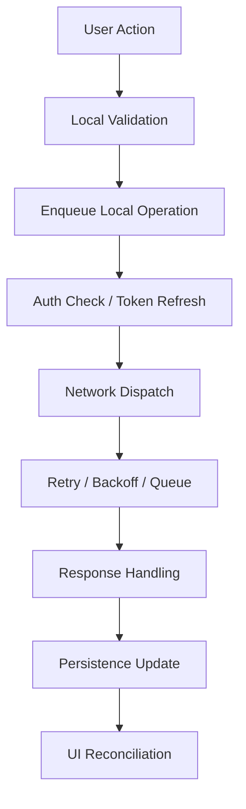

# Request Lifecycle – From Mobile UI to Backend

## Why the Request Lifecycle Matters

In mobile, a “request” is not a moment. It is a **resumable state machine over time** that must survive:

- Network loss
- App suspension or termination
- Token expiry
- Schema drift

---

## High-Level Flow

---

## Stage 1 – UI Trigger & Local Intent

User intent should be recorded **before** any network dispatch.

- Represent intent as domain events (e.g. `CreateFlightNoteIntent`).
- Enables crash-safe recovery and offline-first behavior.

---

## Stage 2 – Local Validation & Serialization

- Validate required fields and data integrity.
- Serialize into a **network-agnostic operation model** to avoid leaking API shape into UI.

---

## Stage 3 – Authentication Gate

- Token freshness checks
- Atomic refresh handling
- Coalescing concurrent refresh requests
- Define failure policy: block vs degrade

---

## Stage 4 – Dispatch & Transport

Attach metadata to every request:

- Idempotency key
- Client version
- Correlation ID

Choose transport:

- Foreground URLSession
- Background transfer
- Push-triggered sync

---

## Stage 5 – Retry & Backoff

- Classify failures:
  - Transient (timeouts, DNS)
  - Terminal (4xx)
- Exponential backoff with jitter
- Bounded retry budget to protect battery

---

## Stage 6 – Persistence & State Repair

- Apply response to local store
- Resolve conflicts
- Repair partial failure states
- Trigger dependent operations

---

## Stage 7 – UI Reconciliation

UI must render from local state, not request callbacks.

This guarantees:

- Resume safety
- Deterministic state recovery

---

## Key concept

> “In mobile, a request is not a function call — it’s a resumable workflow that may survive network loss, token expiry, and process death.”
